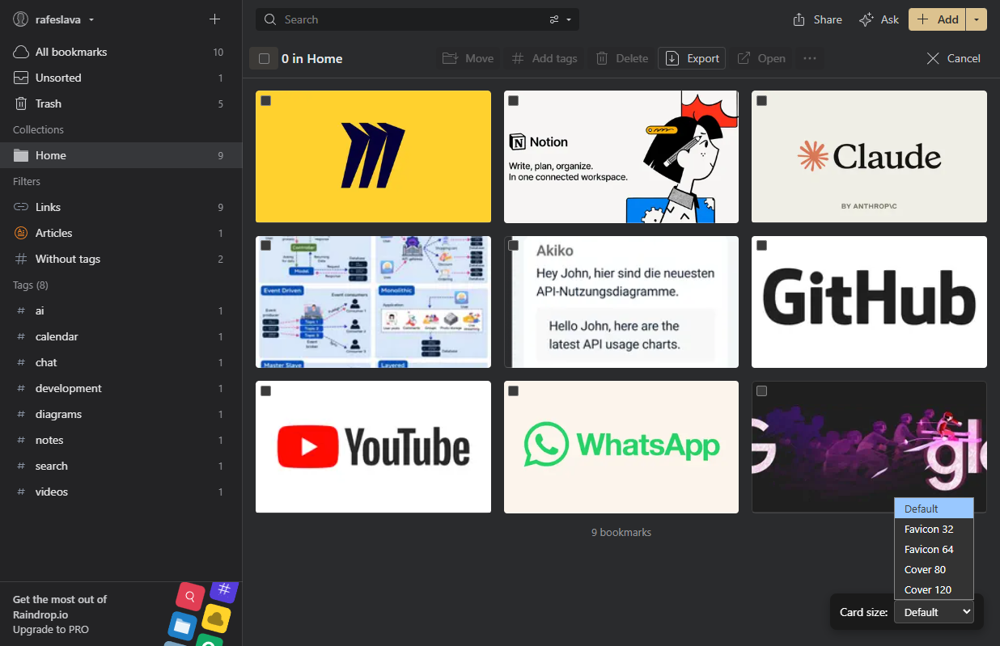
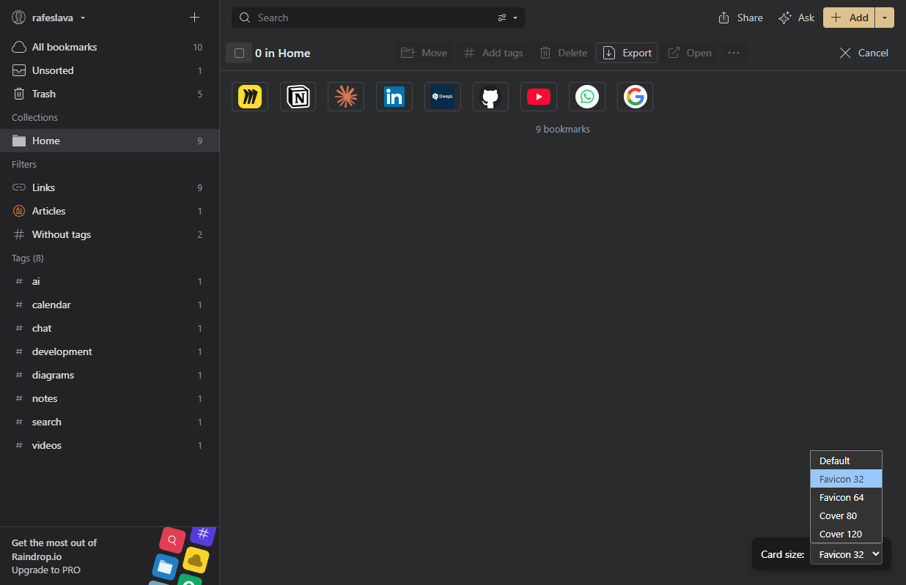
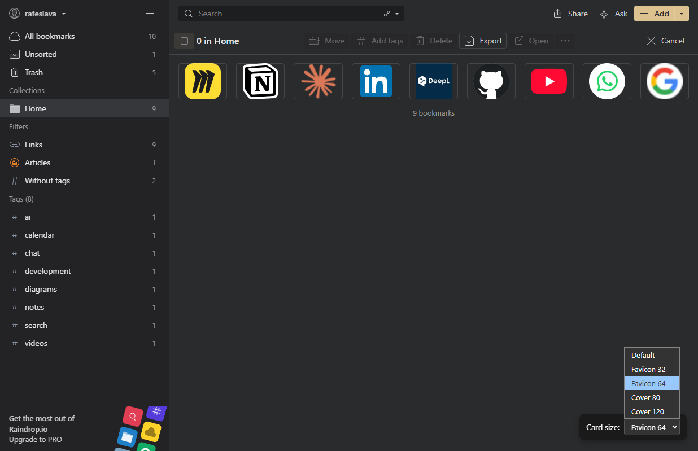
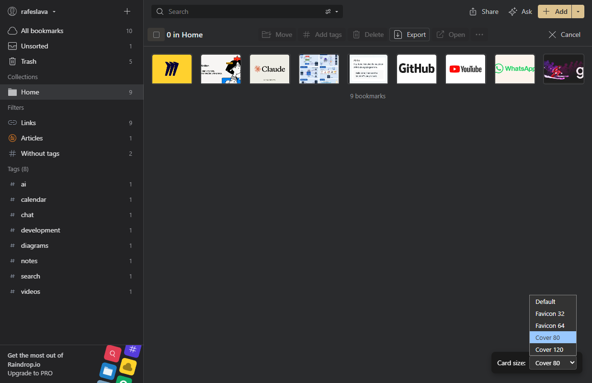
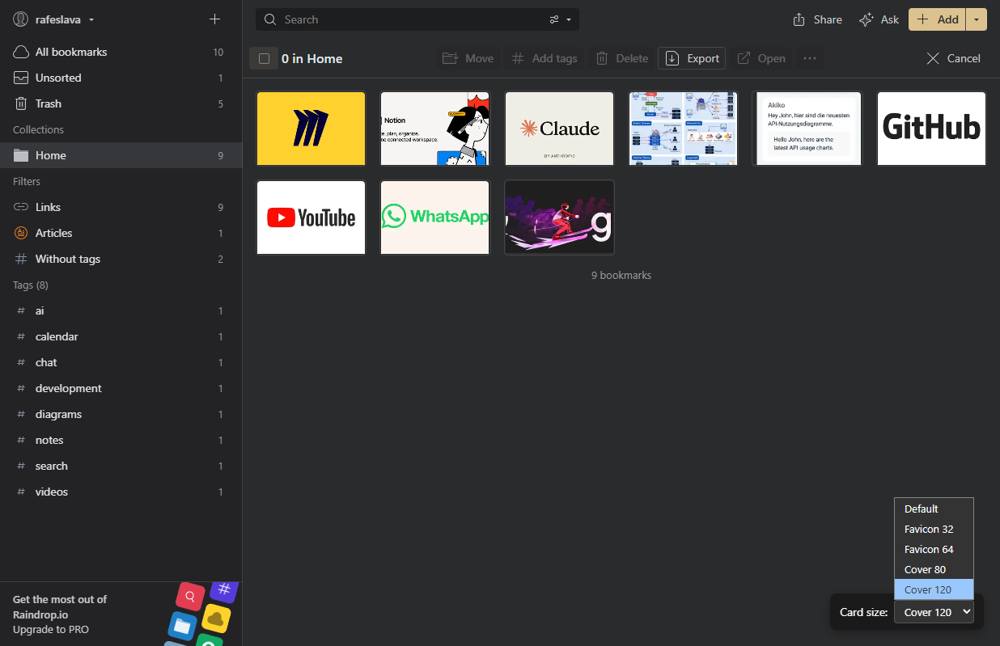

# Raindrop Customization Assets

This repository contains assets used to customize Raindrop.io with CSS and JavaScript (via Tampermonkey/Stylus).

## 🌞 Light / 🌙 Dark Mode Toggle

Use the toggle below to switch between light and dark themes. The layout will adapt accordingly.

  🌙

  

    
    
Default

  

  

    
    
Favicon 32

  

  

    
    
Favicon 64

  

  

    
    
Cover 80

  

  

    
    
Cover 120

  

> **Note:** This Markdown file includes embedded CSS/JS for light/dark mode. It works best in Markdown viewers that support HTML/CSS (e.g., GitHub, VS Code, MkDocs). The toggle saves your preference in `localStorage`.